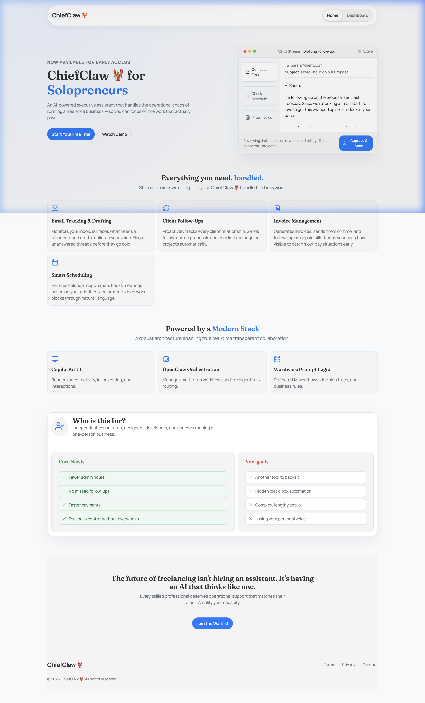

# ChiefClaw 🦞

> **AI-powered executive assistant for solopreneurs** — handles the operational chaos of running a freelance business so you can focus on the work that actually pays.



---

## ✨ Features

| Feature | Description |
|---|---|
| 📧 **Email Tracking & Drafting** | Monitors your inbox, surfaces what needs a response, and drafts replies in your voice. Flags unanswered threads before they go cold. |
| 🔁 **Client Follow-Ups** | Proactively tracks every client relationship. Sends follow-ups on proposals and checks in on ongoing projects automatically. |
| 🧾 **Invoice Management** | Generates invoices, sends them on time, and follows up on unpaid bills. Keeps your cash flow visible to catch slow-pay situations early. |
| 📅 **Smart Scheduling** | Handles calendar negotiation, books meetings based on your priorities, and protects deep work blocks through natural language. |

---

## 🛠️ Tech Stack

### 🤖 AI & Agent Layer

| Tool | Role |
|---|---|
| **[CopilotKit](https://copilotkit.ai/)** | Powers the in-app AI copilot — chat interface, agent actions, and readable context via `@copilotkit/react-core` & `@copilotkit/react-ui` |
| **[AG-UI](https://github.com/ag-ui-protocol/ag-ui)** | Agent-to-UI streaming protocol (`@ag-ui/core`) — used by `clawg-ui` to connect CopilotKit to the OpenClaw backend |
| **[OpenClaw](https://openclaw.ai/)** | Backend agent runtime — the `clawg-ui` plugin exposes an AG-UI endpoint that CopilotKit connects to |

### ⚙️ Frontend

| Tool | Role |
|---|---|
| **[React 19](https://react.dev/)** | UI framework |
| **[Vite](https://vitejs.dev/)** | Lightning-fast dev server & bundler |
| **[React Router v7](https://reactrouter.com/)** | Client-side routing |
| **[Lucide React](https://lucide.dev/)** | Icon library |

---

## 🚀 Getting Started

### Prerequisites

- Node.js `>=18`
- npm `>=9`

### Installation

```bash
# 1. Clone the repo
git clone https://github.com/GeneralJerel/accessclaw.git
cd accessclaw

# 2. Install dependencies
npm install

# 3. Set up environment variables
cp .env.example .env
# Fill in your API keys in .env

# 4. Start the development server
npm run dev
```

The app will be available at **http://localhost:5173**

### Build for Production

```bash
npm run build
npm run preview
```

---

## 📁 Project Structure

```
├── src/
│   ├── components/       # Reusable UI components (Hero, Features, Architecture, etc.)
│   ├── pages/            # Route-level page components (Home, Dashboard)
│   ├── assets/           # Static assets
│   ├── App.jsx           # Root component with routing
│   └── main.jsx          # Application entry point
├── docs/                 # Documentation assets (screenshots, diagrams)
├── mock-data/            # Local mock data for development
└── public/               # Static public files
```

---

## 🤝 Contributing

Pull requests are welcome! For major changes, please open an issue first to discuss what you'd like to change.

1. Fork the project
2. Create your feature branch (`git checkout -b feature/amazing-feature`)
3. Commit your changes (`git commit -m 'Add some amazing feature'`)
4. Push to the branch (`git push origin feature/amazing-feature`)
5. Open a Pull Request

---

## 📄 License

This project is private. All rights reserved © 2026 ChiefClaw.
